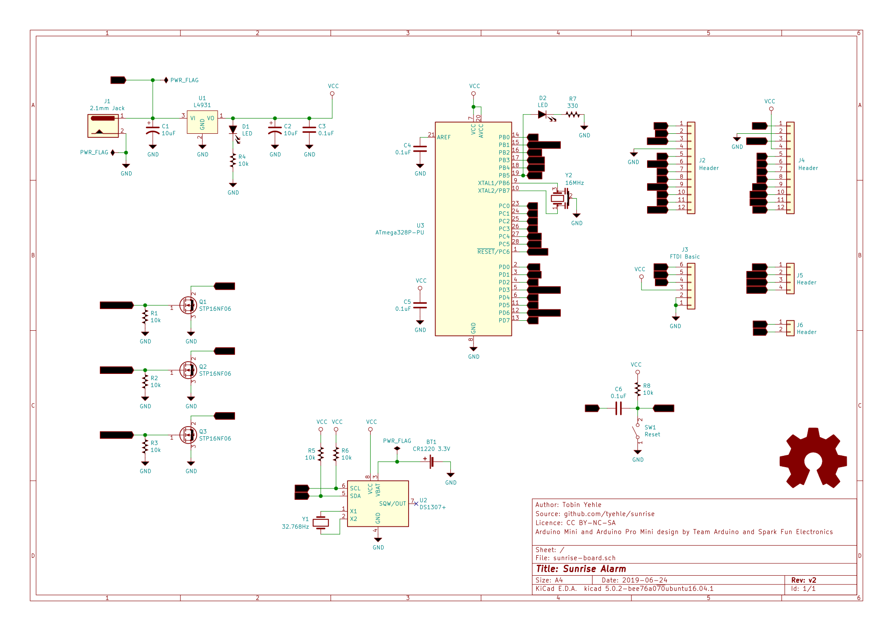

# Sunrise Alarm Hardware
This board is driven by an ATmega238P and has the a similar header layout as an arduino pro mini for debugging or expansion. It also has an RTC and three of the PWM outputs are gated through MOSFETs to provide high power chanells.

# Schematic

# BOM

# Component Placement

# Board

# LICENSE

This work is licensed under a [Creative Commons Attribution-NonCommercial-ShareAlike 4.0 International License](http://creativecommons.org/licenses/by-nc-sa/4.0/).
